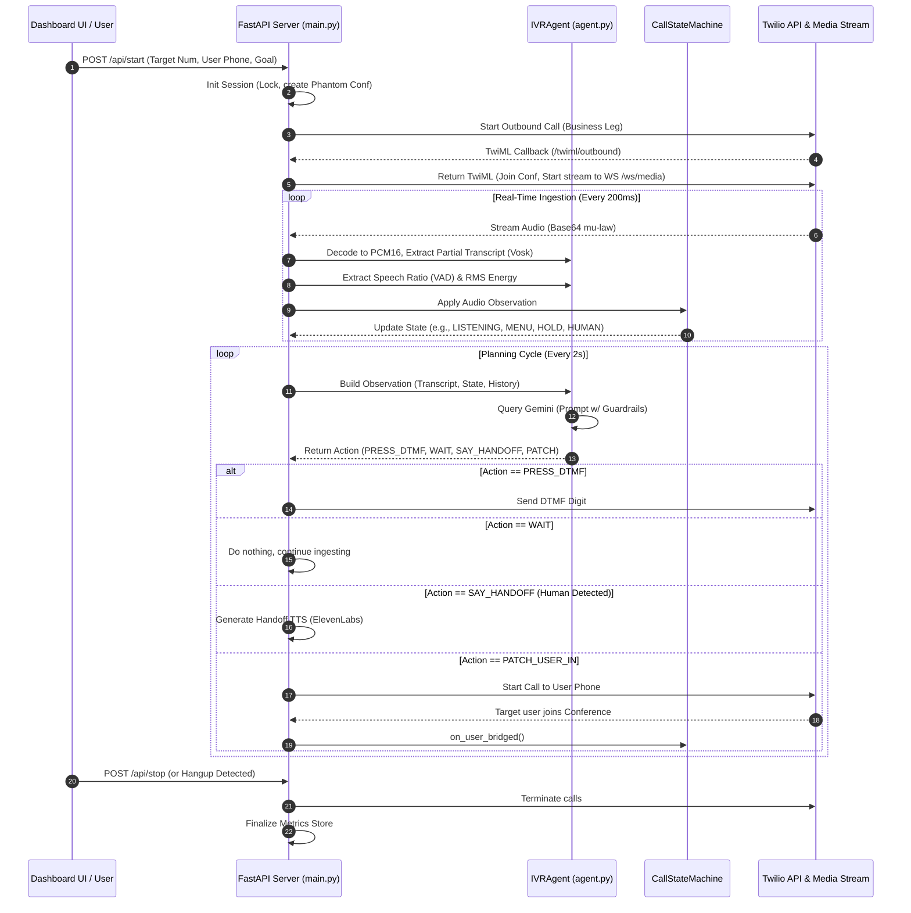

# Autonomous IVR Navigation Agent


Navigating complex Interactive Voice Response (IVR) phone trees is a frustrating, time-consuming process for users trying to reach human representatives or complete routine tasks. Traditionally, this requires a person to sit on hold, listen to slow robotic menus, and manually punch in digits. This project replaces that manual effort with an autonomous voice agent that dials out, listens to the IVR state, and navigates the tree on behalf of the user, bridging the call only when a human representative is finally reached.

**Outcomes:**
- ⏱️ **Time Saved:** Saves callers an average of **15 minutes** per session.
- 🏢 **Proven Reliability:** Successfully tested across **10 production IVR systems** (including major telecom and utility providers) in real-world environments.
- 🤖 **End-to-End Automation:** Eliminates the need to listen to hold music or menu options entirely.

> **Demo Status:** Live demo suspended (API costs) — see the architecture and recorded walkthrough below.

## How it Works (Summary)

Behind the scenes, the Autonomous IVR Navigation agent acts as a virtual proxy. When a user requests to call a business, the system dials the business and joins a virtual conference room. It listens to the audio on the line, transcribing the automated menus into text in real-time. By analyzing this text along with the volume and speech patterns (detecting hold music vs. talking), an AI planner decides what to do next—whether to press a button, wait, or hand off the call. Once the agent detects that a real human has answered, it plays a brief introductory message explaining the caller's intent and then instantly connects the user to the representative.

## Architecture



### Core Modules

| Module | Responsibility |
|---|---|
| `app/main.py` | FastAPI app, HTTP/WS endpoints, session lifecycle, orchestration loop |
| `app/agent.py` | ASR ingestion (Vosk), VAD analysis, planner call, action guardrails |
| `app/state_machine.py` | Explicit call-state transitions + hold-time accounting |
| `app/metrics.py` | Session KPI recording and aggregate metrics |
| `app/telephony.py` | Twilio operations (outbound call, DTMF, hangup, TwiML builders) |
| `app/audio.py` | Twilio mu-law decode, PCM chunking, RMS energy |
| `app/tts.py` | Optional ElevenLabs handoff narration |
| `app/templates/index.html` + `app/static/app.js` | Operator dashboard + live telemetry stream |

### Real-Time Pipeline Detailed

1. **Start request**: `POST /api/start` validates payload and required config.
2. **Session init**: Shared `SESSION` object is populated under `SESSION_LOCK`.
3. **Business leg dial**: Twilio outbound call is created with TwiML URL `/twiml/outbound`.
4. **Media attach**: TwiML starts media streaming to `WS /ws/media` and joins the virtual conference.
5. **Audio processing**:
   - base64 mu-law payload -> PCM16 decode
   - 200 ms chunking (`3200` bytes)
   - 20 ms frames (`320` bytes) for VAD
   - Vosk partial transcript extraction
6. **State classification**: transcript + speech ratio + energy are fed into `CallStateMachine`.
7. **Planning**: observation snapshot is passed to Gemini planner (or deterministic fallback).
8. **Safe action execution**:
   - `PRESS_DTMF` only with transcript evidence
   - repeat-digit suppression
   - handoff-before-patch rule
9. **Finalize**: on stop/disconnect/hangup, state closes, KPIs are recorded, session resets.

### State Machine

**States:** `IDLE`, `LISTENING`, `MENU`, `HOLD`, `HUMAN_DETECTED`, `HANDOFF_READY`, `PATCHING_USER`, `BRIDGED`, `FINISHED`, `ERROR`

**Transition drivers:**
- audio observation classification (`apply_audio_observation`)
- planner action events (`on_action`)
- conference bridge event (`on_user_bridged`)
- terminal events (`finish`, `fail`)

### Concurrency Model

- Shared live session state is synchronized with `asyncio.Lock` (`SESSION_LOCK`).
- Blocking SDK/API operations (such as TTS generation and Twilio requests) are offloaded with `asyncio.to_thread(...)`.
- WebSocket ingestion, planner cadence, Twilio API calls, and UI broadcast run concurrently under real-time telephony timing constraints.

## API Surface

### HTTP Routes
- `GET /` dashboard
- `POST /api/start` start autonomous call session
- `POST /api/stop` stop active session
- `GET /api/status` session/state/config snapshot
- `GET /api/metrics` KPI summary
- `GET /health` config readiness
- `GET /audio/handoff.mp3` generated handoff clip
- `POST /twiml/outbound` TwiML for business leg
- `POST /twiml/join_user` TwiML for user leg

### WebSocket Routes
- `WS /ws/media` Twilio media ingress
- `WS /ws/ui` live telemetry for dashboard clients

## Project Structure

```text
Caller/
├── .env.example
├── .gitignore
├── .python-version
├── requirements.txt
├── README.md
└── app/
    ├── main.py
    ├── agent.py
    ├── state_machine.py
    ├── metrics.py
    ├── telephony.py
    ├── tts.py
    ├── audio.py
    ├── static/
    │   └── app.js
    ├── templates/
    │   └── index.html
    └── models/
        └── vosk/
```

## Configuration

**Required environment variables:**
- `PUBLIC_BASE_URL`
- `TWILIO_ACCOUNT_SID`
- `TWILIO_AUTH_TOKEN`
- `TWILIO_FROM_NUMBER`
- `GEMINI_API_KEY`

**Optional:**
- `ELEVENLABS_API_KEY`
- `ELEVENLABS_VOICE_ID`
- `VOSK_MODEL_PATH`

## Local Run

```bash
cd Autonomous-IVR-Navigation-Agent
python3 -m venv .venv
source .venv/bin/activate
pip install -r requirements.txt
cp .env.example .env
uvicorn app.main:app --reload --port 8000
```

Open `http://127.0.0.1:8000`.
